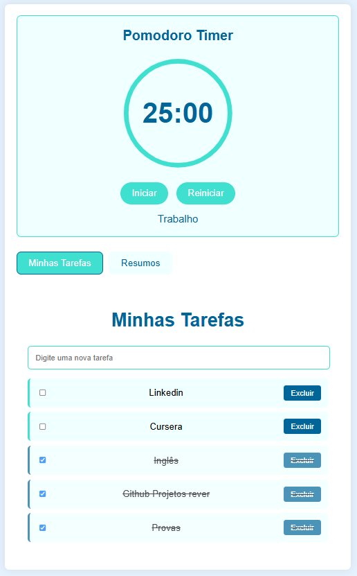
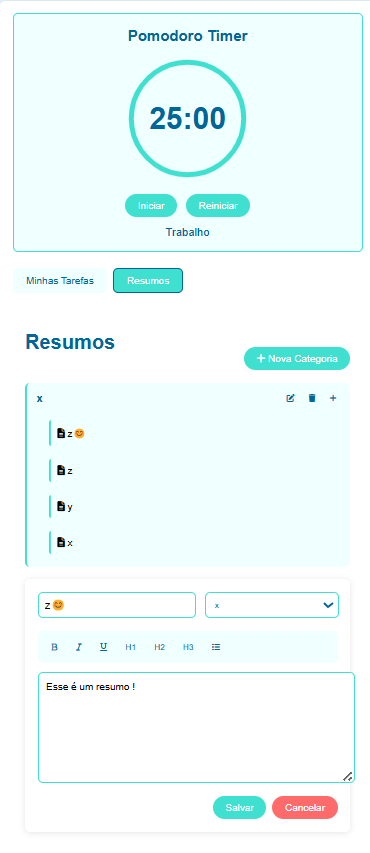
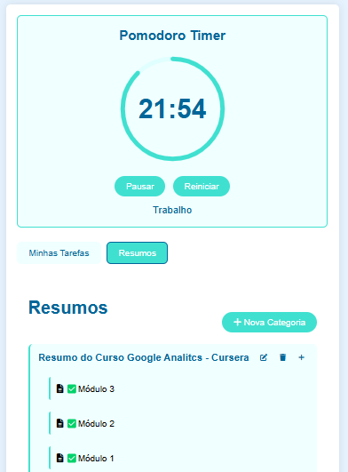

# Organizador

- Projeto simples usando  HTML, CSS e JS. 

- Trata-se de um organizador \ Planejador para usar nos estudos e metas. 

### Objetivos:

- Sistema Pomodoro 25\5 
- Música Lofi ao iniciar. 
- Sistema de anotações

Fique a vontade para da fork ou clonar!

- Pomodoro e Tasks

- Zona de Edição de Estudos

- Exemplo:

